# MPS - 블록체인 기반 음원 라이브러리 플랫폼

  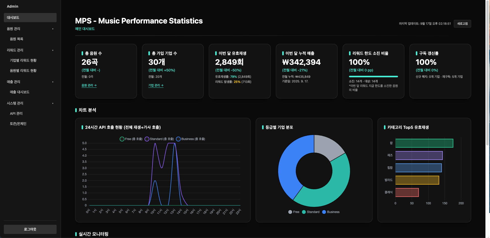

<h1 align="center">MPS (Music Performance Statistics)</h1>

"MPS는 블록체인 기반 음원 라이브러리 플랫폼으로, 기업이 음원을 외부 서비스에서 안전하고 투명하게 활용할 수 있도록 지원하는 B2B 서비스입니다. 본 문서는 전체 프로젝트 중 관리자 대시보드(Admin) 부분에 대한 상세 내용을 다룹니다."

---

## 목차
- [프로젝트 소개](#프로젝트-소개)
- [프로젝트 개요](#프로젝트-개요)
- [배포 정보](#배포-정보)
- [주요 기능](#주요-기능)
- [팀원 및 주요 기여](#팀원-및-주요-기여)
- [시스템 아키텍처](#시스템-아키텍처)
- [화면 구성 및 기능](#화면-구성-및-기능)
  - [관리자 인증](#관리자-인증)
  - [메인 대시보드](#메인-대시보드)
  - [음원 관리](#음원-관리)
  - [기업 관리](#기업-관리)
  - [매출 관리](#매출-관리)
  - [시스템 관리](#시스템-관리)
- [API 주요 명세](#api-주요-명세)
- [기술 스택 및 협업 도구](#기술-스택-및-협업-도구)
- [프로젝트 회고 (4L)](#프로젝트-회고-4l)

---
## 프로젝트 소개

MPS는 블록체인 기반의 음원 라이브러리 플랫폼으로, 기업이 등록된 음원을 외부 서비스에서 안전하고 투명하게 활용할 수 있도록 지원하는 B2B 서비스입니다. 플랫폼은 API를 통해 음원 사용을 손쉽게 연동할 수 있으며, 모든 사용 내역은 블록체인에 기록되어 저작권과 정산 과정을 신뢰성 있게 관리할 수 있습니다. 음원을 이용하는 기업(Client)은 특정 음원을 사용할 때 토큰 형태의 리워드를 지급받고, 이는 플랫폼 이용료 할인혜택으로 사용할 수 있습니다. 관리(Admin) 영역에서는 음원의 등록과, 등록된 음원에 대한 사용 내역, 매출 현황, 리워드 지급 정보를 시각화된 형태로 확인할 수 있으며, 이를 통해 음원 등록과 리워드 관리까지 수행할 수 있습니다. 

---

## 프로젝트 개요
- **프로젝트명**: MPS Admin - Music Performance Statistics
- **목적**: 블록체인 기반 음원 라이브러리 플랫폼 개발 (본인은 관리자 대시보드 부분 담당)
- **협업 기업**: 크로스허브 (부트캠프 협약 기업)
- **개발 방식**: 기업 요구사항 문서 기반 실무 프로젝트
- **개발 기간**: 2025.08.08 ~ 2025.09.14
- **참여 인원**: 총 3명

---

## 배포 정보

### 테스트 환경

#### 웹 클라이언트 서비스
- **클라이언트 웹사이트**: [https://client.klk1.store/](https://admin.klk1.store/)
- **API 테스트 사이트**: [https://test.klk1.store/test.html](https://test.klk1.store/test.html)

#### 백엔드 API 서버
- **API 서버**: [https://api.klk1.store/](https://api.klk1.store/)

#### 웹 관리자 대시보드
- **배포된 웹사이트**: [https://admin.klk1.store/](https://admin.klk1.store/)
- **대체 배포**: [https://mps-project-frontend-admin-.vercel.app/](https://mps-project-frontend-admin-.vercel.app/)

### 관리자 접근(관리자 대시보드)
- **관리자 계정**: 
  - ID: `admin`
  - PW: `admin1234`
- **인증 방식**: JWT 기반 토큰 인증
- **세션 관리**: 8시간 자동 만료

---

## 주요 기능

### 음원 관리
* 음원 등록, 수정, 삭제 (오디오 파일, 가사 파일, 커버 이미지)
* 음원 카테고리 관리 및 분류
* 음원별 사용 통계 및 리워드 현황 조회
* 음원 등급 관리 (Free, Standard, Business 등급)
* 월별 리워드 한도 설정 및 잔여량 관리
* 음원별 리워드 수정 및 삭제
* 실시간 리워드 발생/지급 내역 추적
* 음원 호출 API 모니터링 (`/api/music/play`, `/api/lyrics/get`)

### 기업 관리
* 기업별 음원 사용 현황 모니터링
* 기업 등급별 분포 통계
* 기업별 리워드 사용 내역 및 지급 현황
* 구독 플랜별 접근 권한 (Free, Standard, Business)
* 기업별 음원 구매/사용 통계 및 리워드 발생량 추적

### 실시간 모니터링
* WebSocket 기반 실시간 API 호출 현황
* 최근 5분간 API 호출 로그 실시간 표시
* 24시간 인기 음원 TOP 10 실시간 업데이트
* API 호출 성공/실패 상태 모니터링
* 리워드 발생 실시간 추적 (유효재생/무효재생 구분)
* 음원/가사 호출 구분 (use_case별 호출 타입 분류)
* 기업별 실시간 사용량 모니터링

### 매출 및 리워드 관리
* 월별 매출 트렌드 분석
* 구독 플랜별 매출 현황 (Free, Standard, Business)
* 음원별 리워드 지급 현황 및 통계
* 기업별 리워드 사용 통계
* 월별 리워드 한도 관리 (총량 및 잔여량 설정)
* 음원별 재생당 리워드 지급 금액 설정
* 기업별 리워드 사용 내역 및 누적 통계
* 음원별 수익 분석 및 수익성 평가

### 시스템 관리
* API 키 관리 및 모니터링
* 토큰/온체인 거래 내역 조회

---

## 팀원 및 주요 기여

| 이름   | 깃허브                               | 주요 기여                                                                                                                                                                                                                            |
| :----- | :----------------------------------- | :----------------------------------------------------------------------------------------------------------------------------------------------------------------------------------------------------------------------------------- |
| 김민교 | [@Sialsry](https://github.com/Sialsry) | **팀장 & 스마트 컨트랙트 개발** • 블록체인 스마트 컨트랙트 설계 및 구현 • 토큰 경제 모델 설계 • 팀 리딩 및 프로젝트 관리 |
| 이상암 | [sangam0919](https://github.com/sangam0919) | **클라이언트 풀스택 개발** • 클라이언트 웹 애플리케이션 개발 • 사용자 인터페이스 및 사용자 경험 설계 • 프론트엔드-백엔드 연동 개발 • API 통합 및 데이터 흐름 구현 |
| 김지은 | [@zzeen2](https://github.com/zzeen2) | **백오피스 풀스택 개발** • 관리자 대시보드 개발 • 음원 관리 시스템 구현 • 실시간 모니터링 시스템 개발 • API 통합 및 데이터 흐름 구현 |

---

## 시스템 아키텍처

### 유즈케이스 다이어그램

  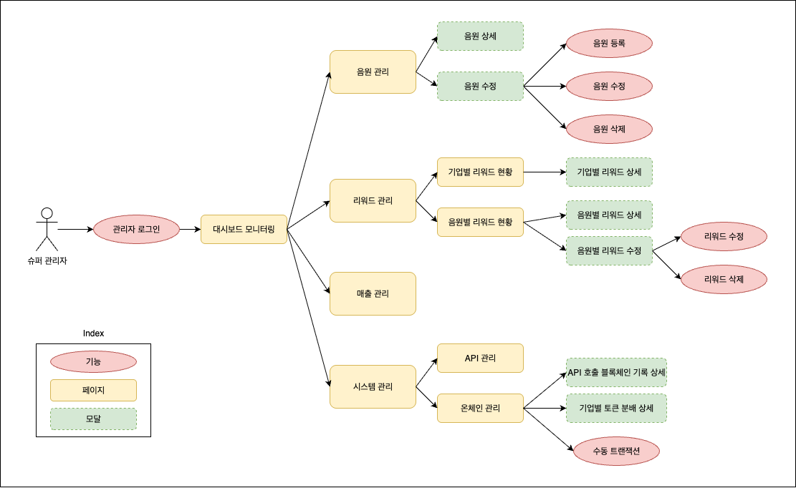
   <b>MPS Admin 시스템 유즈케이스 다이어그램</b>

### 데이터베이스 설계 (ERD)

  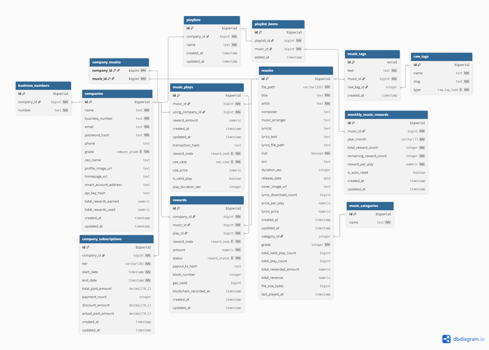
   <b>MPS Admin 데이터베이스 ERD</b>

---

## 화면 구성 및 기능

### 관리자 인증
  

    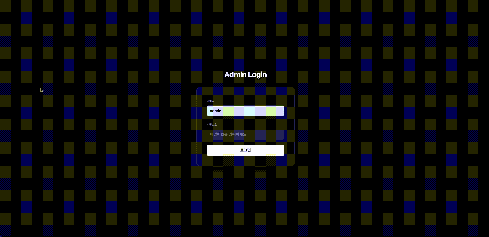
     <b>관리자 로그인</b>
  

**주요 기능**:
- **JWT 기반 인증**: 관리자 ID/PW로 로그인
- **자동 토큰 갱신**: 8시간 세션 유지
- **보안 쿠키**: HttpOnly 쿠키로 토큰 관리

### 메인 대시보드

  
   <b>메인 대시보드 - 전체 현황</b>

  
   <b>대시보드 실시간 시연 영상 (MPS 테스트 페이지 음원/가사 호출)</b>

**주요 기능**:

- 총 음원 수, 기업 수, 월간 재생 수, 월간 매출 등 핵심 지표 표시
- 24시간 API 호출 차트로 시간별 호출 현황 시각화
- 등급별 기업 분포 파이차트 (Free/Standard/Business)
- 카테고리 TOP5 막대그래프 (카테고리별 유효재생 수)
- 인기 음원 TOP10 순위 (24시간 기준)
- WebSocket 기반 실시간 API 호출 로그 (최근 5분간)
- 음원 재생 시 실시간 소켓 알림
- 리워드 발생 실시간 업데이트
- 기업별 사용량 실시간 모니터링

### 음원 관리

#### 음원 목록 화면

  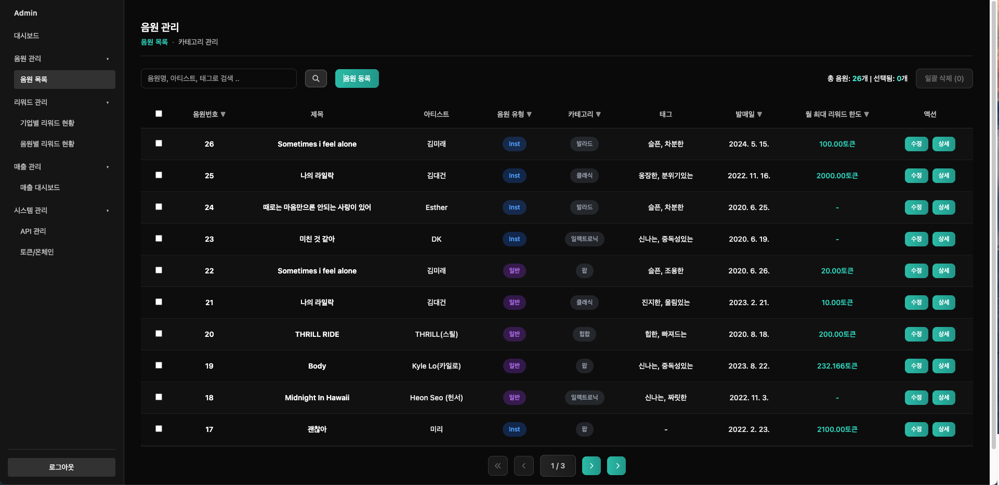
   <b>음원 목록 관리</b>

#### 음원 관리 기능

  <table>
    <tr>
      <td align="center">
         
        <b>음원 등록</b>
      </td>
      <td align="center">
        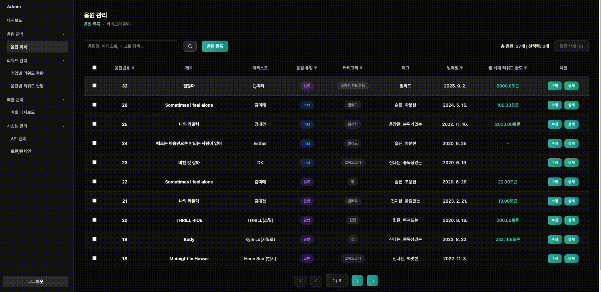 
        <b>음원 상세</b>
      </td>
    </tr>
    <tr>
      <td align="center">
        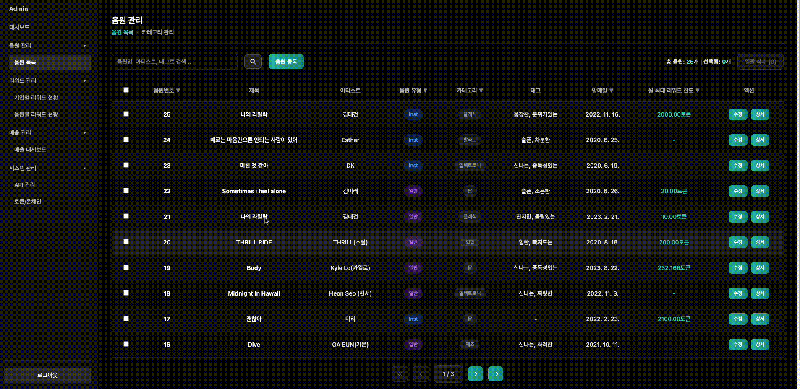 
        <b>음원 수정</b>
      </td>
      <td align="center">
        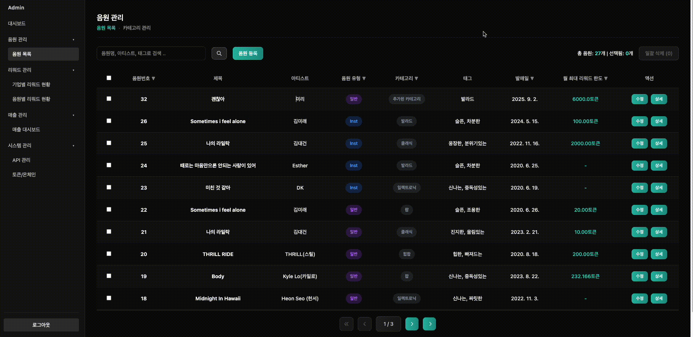 
        <b>음원 삭제</b>
      </td>
    </tr>
  </table>

**주요 기능**:
- 음원 목록 조회 (검색, 필터링, 페이지네이션)
- 음원 등록 (오디오 파일, 가사 파일, 커버 이미지 업로드)
- 음원 상세 조회 (음원 정보, 통계, 리워드 현황)
- 음원 정보 수정 (제목, 아티스트, 카테고리, 가격 등)
- 음원 삭제 (단일/다중 선택 삭제)
- 음원별 리워드 한도 설정 및 수정 (개별/일괄 수정 가능)
- 음원별 사용 통계 및 리워드 지급 현황 조회
- 테이블 컬럼별 필터링 및 정렬 기능

#### 음원별 리워드 현황

  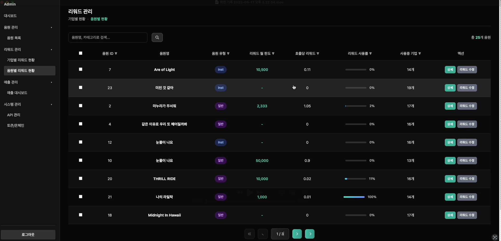
   <b>음원별 리워드 현황</b>

#### 리워드 관리 시연
#### 리워드 관리 기능

  <table>
    <tr>
      <td align="center">
        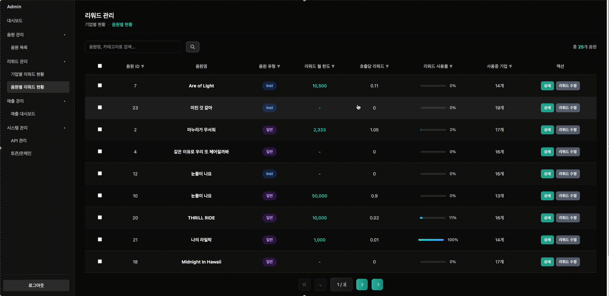 
        <b>음원 상세 모달</b>
      </td>
      <td align="center">
        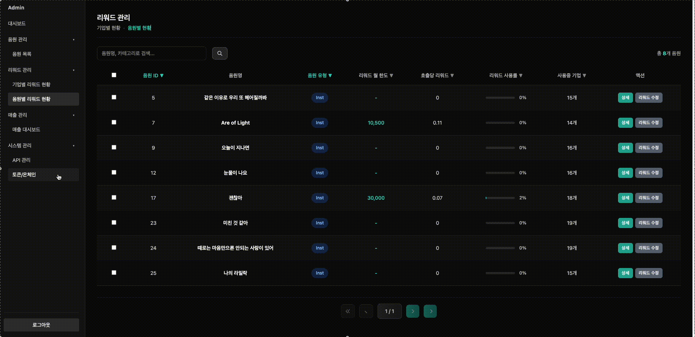 
        <b>일괄 리워드 수정</b>
      </td>
    </tr>
  </table>

**음원 리워드 관리 기능**:
- 음원별 리워드 지급 현황 조회 (월별 통계)
- 음원별 리워드 한도 설정 및 수정 (개별/일괄)
- 리워드 지급 트렌드 분석
- 월별 리워드 한도 관리
- 리워드 지급률 및 사용률 통계

### 기업 관리
#### 기업별 리워드 현황

  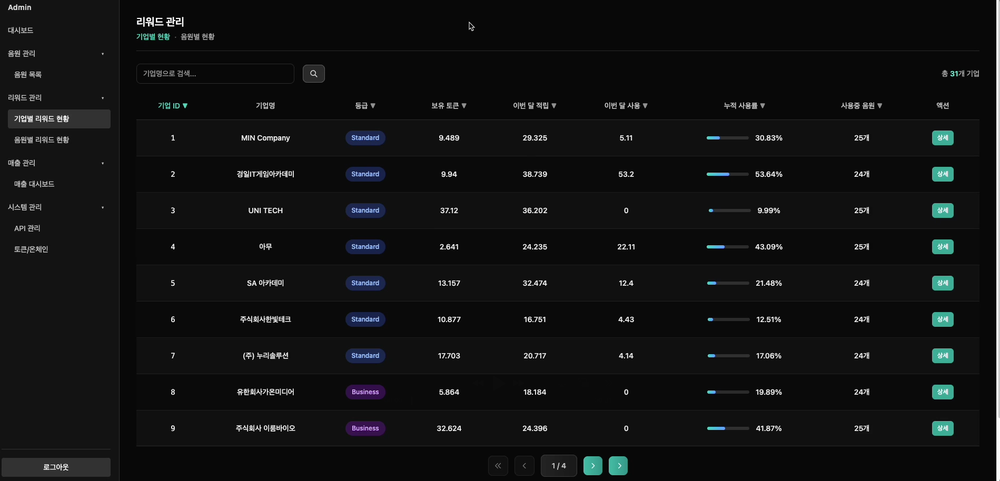
   <b>기업별 리워드 현황</b>

#### 기업 관리 기능

  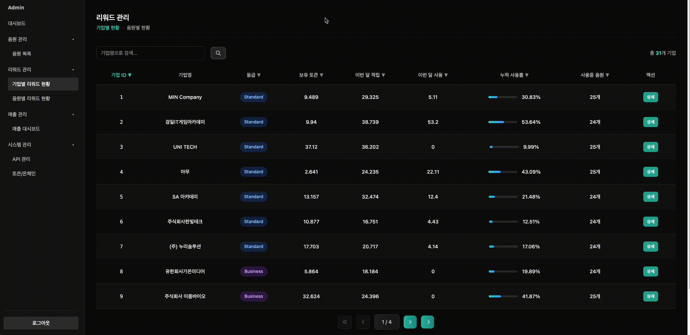 
  <b>기업 상세 정보 및 통계</b>

**주요 기능**:
- 기업 목록 조회 (검색, 필터링, 페이지네이션)
- 기업 정보 열람 (기업명, 구독 플랜, 연락처, 등록일 등)
- 기업별 음원 사용 통계 조회
- 기업별 리워드 사용 현황 조회
- 테이블 컬럼별 필터링 및 정렬 기능

### 매출 관리

#### 매출 대시보드

  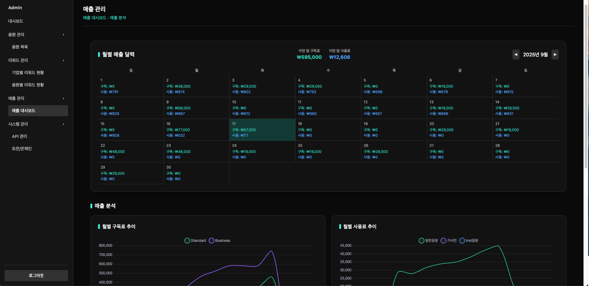
   <b>매출 대시보드 - 상단</b>

  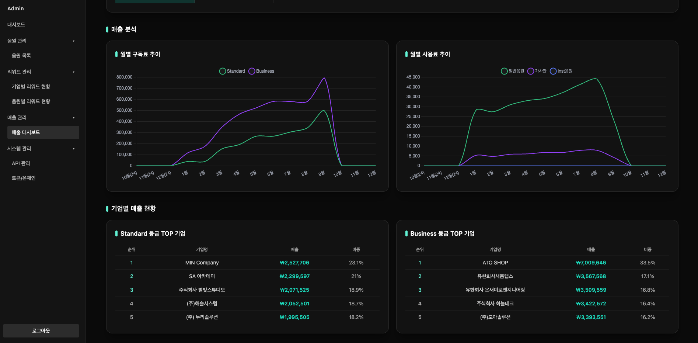
   <b>매출 대시보드 - 하단</b>

**주요 기능**:
- 월별 매출 트렌드 분석 (차트 시각화)
- 구독 플랜별 매출 현황 (Free, Standard, Business)
- 기업별 매출 기여도 및 순위
- 월별 리워드 지급 현황 통계
- 기업별 리워드 사용량 분석
- 매출 캘린더 (일별 매출 현황)

### 시스템 관리

#### API 관리

  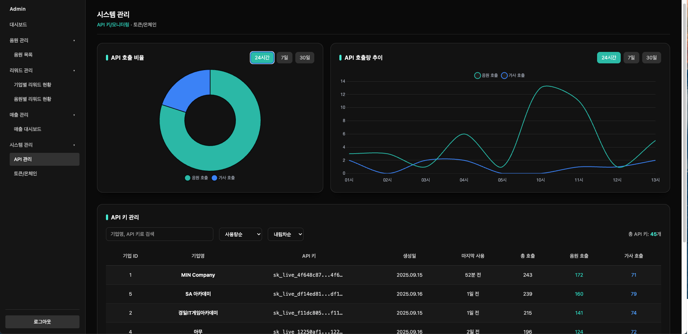
   <b>API 관리</b>

#### 온체인 관리

  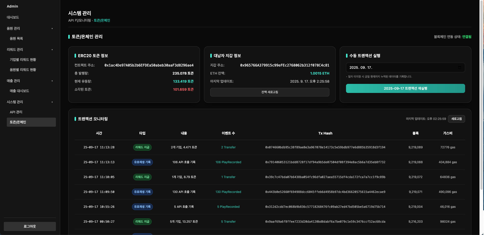
   <b>온체인 관리</b>

#### 온체인 관리 기능

  <table>
    <tr>
      <td align="center">
        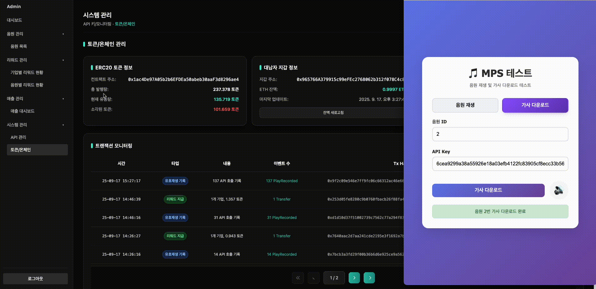 
        <b>수동 트랜잭션</b>
      </td>
      <td align="center">
        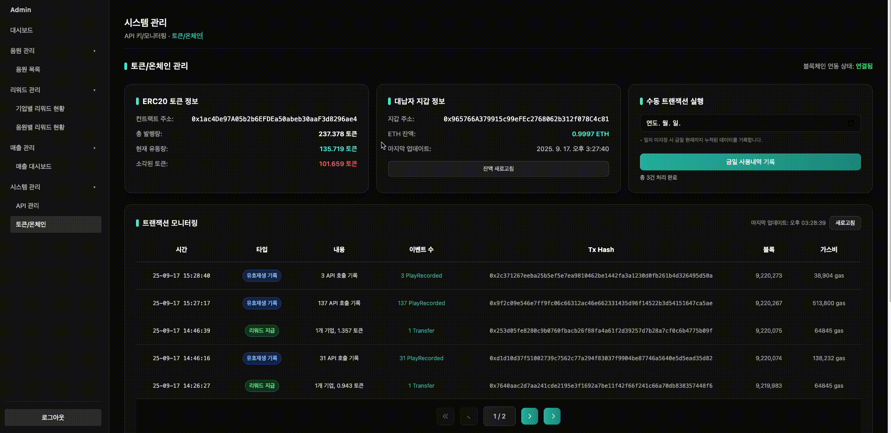 
        <b>트랜잭션 상세</b>
      </td>
    </tr>
  </table>

**주요 기능**:
- API 키 조회 및 모니터링
- API 호출 통계 및 성능 모니터링 (기간별 조회)
- 토큰 정보 조회 (총 공급량, 발행량, 소각량, 유통량)
- 지갑 정보 조회 (잔액, 주소, 상태)
- 일별 배치 트랜잭션 조회
- 트랜잭션 상세 내역 조회
- 수동 트랜잭션 실행
- 온체인 데이터 실시간 동기화

---

## API 주요 명세

### 📋 API 문서
- **전체 API 명세서**: [MPS API 문서](https://docs.google.com/spreadsheets/d/1EyoP9JkvOEZNFqQdr-SQTYzVeAZPKTfvYhmhP_8_aJs/edit?gid=0#gid=0)

### 관리자 인증 API
| Method | Path | Description | 기능 |
|--------|------|-------------|------|
| POST | `/admin/login` | 관리자 로그인 | JWT 토큰 발급 |
| POST | `/admin/logout` | 관리자 로그아웃 | 토큰 무효화 |
| POST | `/admin/refresh-token` | 토큰 갱신 | 액세스 토큰 갱신 |

### 대시보드 API
| Method | Path | Description | 기능 |
|--------|------|-------------|------|
| GET | `/admin/companies/total-stats` | 전체 통계 조회 | 음원 수, 기업 수, 재생 수 등 |
| GET | `/admin/companies/hourly-plays` | 시간별 재생 현황 | 24시간 API 호출 차트 데이터 |
| GET | `/admin/companies/tier-distribution` | 등급별 기업 분포 | 기업 등급별 분포 통계 |
| GET | `/admin/musics/category-top5` | 카테고리 TOP5 | 카테고리별 유효재생 수 |
| GET | `/admin/musics/realtime/api-status` | 실시간 API 상태 | 최근 5분간 API 호출 로그 |
| GET | `/admin/musics/realtime/top-tracks` | 실시간 인기 음원 | 24시간 인기 음원 TOP10 |

### 음원 관리 API
| Method | Path | Description | 기능 |
|--------|------|-------------|------|
| GET | `/admin/musics` | 음원 목록 조회 | 검색, 필터링, 페이지네이션 |
| POST | `/admin/musics` | 음원 등록 | 새 음원 정보 등록 |
| GET | `/admin/musics/:id` | 음원 상세 조회 | 특정 음원 상세 정보 |
| PATCH | `/admin/musics/:id` | 음원 정보 수정 | 음원 정보 업데이트 |
| DELETE | `/admin/musics` | 음원 삭제 | 선택된 음원들 삭제 |
| POST | `/admin/musics/upload` | 파일 업로드 | 오디오, 가사, 커버 이미지 업로드 |
| GET | `/admin/musics/rewards/summary` | 음원별 리워드 현황 | 음원별 리워드 지급 통계 |
| GET | `/admin/musics/rewards/trend` | 리워드 트렌드 | 음원별 리워드 변화 추이 |

### 기업 관리 API
| Method | Path | Description | 기능 |
|--------|------|-------------|------|
| GET | `/admin/companies` | 기업 목록 조회 | 등록된 기업 목록 |
| POST | `/admin/companies` | 기업 등록 | 새 기업 정보 등록 |
| PATCH | `/admin/companies/:id` | 기업 정보 수정 | 기업 정보 업데이트 |
| DELETE | `/admin/companies/:id` | 기업 삭제 | 기업 정보 삭제 |
| GET | `/admin/companies/rewards/summary` | 기업별 리워드 현황 | 기업별 리워드 사용 통계 |
| GET | `/admin/companies/renewal-stats` | 갱신 통계 | 기업 구독 갱신 현황 |

### 매출 관리 API
| Method | Path | Description | 기능 |
|--------|------|-------------|------|
| GET | `/admin/companies/revenue/trends` | 매출 트렌드 | 월별 매출 변화 추이 |
| GET | `/admin/companies/revenue/companies` | 기업별 매출 | 주요 기업별 매출 현황 |
| GET | `/admin/companies/revenue/calendar` | 매출 캘린더 | 일별 매출 현황 |

### 시스템 관리 API
| Method | Path | Description | 기능 |
|--------|------|-------------|------|
| GET | `/admin/system/api/stats` | API 통계 | API 호출 통계 및 성능 |
| GET | `/admin/system/api/chart` | API 차트 | API 사용량 차트 데이터 |
| GET | `/admin/system/api/keys` | API 키 관리 | API 키 목록 및 상태 |
| GET | `/admin/tokens/info` | 토큰 정보 | 블록체인 토큰 정보 |
| GET | `/admin/tokens/wallet` | 지갑 정보 | 지갑 잔액 및 상태 |
| GET | `/admin/tokens/transactions` | 거래 내역 | 토큰 거래 내역 조회 |

---

## 기술 스택 및 협업 도구

- **Frontend**:
  
  
  
  
  
  

- **Backend**:
  
  
  
  

- **Database**:
  

- **Infrastructure**:
  
  

- **Version Control**:
  
  

- **Collaboration Tools**:
  
  

---

## 프로젝트 회고 (4L)

### 좋았던 점 (Liked)

풀스택 관점에서 백오피스 시스템을 설계하여 관리자에게 필요한 정보를 우선순위와 계층적으로 배치했습니다. 복잡한 통계 데이터를 Chart.js를 활용한 차트와 그래프로 직관적으로 표현하여 관리자가 쉽게 이해할 수 있도록 구현했습니다. 특히 실시간 모니터링과 정적 통계를 분리하여 표시하고, 다양한 필터링 옵션을 제공하여 효율적인 데이터 검색이 가능하도록 했습니다.

데이터 처리 측면에서는 `Music`, `Company`, `Reward`, `Statistics` 테이블 간의 복잡한 다중 조인을 효율적으로 관리했습니다. Drizzle ORM의 타입 안전성을 활용한 기본 쿼리와 복잡한 통계 계산을 위한 Raw Query를 적절히 조합하여 데이터베이스 레벨에서 직접 수행함으로써 애플리케이션 부하를 최소화했습니다. 특히 실시간 통계 데이터 조회 시 인덱싱과 쿼리 최적화를 통해 성능을 크게 향상시켰습니다.

### 새롭게 배운 점 (Learned)

B2B 관리 시스템의 복잡성을 깊이 이해할 수 있었습니다. 음원 라이브러리, 기업 관리, 리워드 시스템, 매출 분석 등 다양한 도메인이 서로 연관되어 있는 구조에서 각각의 비즈니스 로직을 정확히 파악하고 구현하는 것이 중요함을 배웠습니다. 특히 NestJS의 모듈 시스템을 활용하여 admin, musics, company, system, tokens 등 기능별로 명확하게 분리된 구조를 설계하면서 코드의 가독성과 유지보수성이 크게 향상되는 것을 경험했습니다.

Drizzle ORM을 활용한 복잡한 SQL 쿼리 작성과 데이터베이스 최적화에 대한 실무 경험을 쌓을 수 있었습니다. 특히 실시간 통계 데이터를 효율적으로 조회하기 위한 인덱싱과 쿼리 최적화 기법들을 학습했으며, Drizzle ORM의 타입 안전성과 Raw Query의 성능을 적절히 조합하는 방법을 익혔습니다. Socket.io를 활용한 실시간 데이터 전송 시스템을 처음 구현해보면서 WebSocket의 동작 원리와 실시간 통신의 장단점을 이해할 수 있었습니다.

### 부족했던 점 (Lacked)

관리자 페이지 구현 시 화면별, 카드별로 다양한 데이터를 조회해야 하면서 Raw Query가 급증했습니다. 유사한 집계 작업이 중복 구현되어 `JOIN` 조건이나 기타 기준에서 미묘한 차이가 발생했으며, 선택적 필터 누락, `LEFT JOIN`과 `INNER JOIN`의 일관성 없는 사용, 기간 경계 처리 문제로 인한 데이터 누락이 발생했습니다. 

테스트 측면에서는 Postman을 통한 수동 API 테스트에만 의존하여 응답 데이터만 확인하는 수준이었습니다. 충분한 단위 테스트와 통합 테스트가 부족하여 쿼리 변경 시 조기 에러 감지가 어려웠으며, 복잡한 비즈니스 로직들이 많음에도 불구하고 테스트 코드가 없어서 기능 수정 시 사이드 이펙트를 예측하기 어려운 상황이었습니다. 특히 Drizzle ORM과 Raw Query가 혼재된 복잡한 쿼리 로직에 대한 체계적인 테스트 전략이 부족했습니다.

### 구현하고 싶었지만 구현하지 못한 점 (Longed for)

중복된 통계 쿼리를 모듈화하여 중앙에서 관리하여 향후 문제를 줄이고 싶었습니다. 각 쿼리와 통계 엔드포인트에 대한 Jest를 활용한 단위 테스트 및 통합 테스트를 구현하여 수정 시 조기 에러 감지가 가능하도록 하고 싶었습니다. 특히 Drizzle ORM과 Raw Query가 혼재된 복잡한 쿼리 로직에 대한 체계적인 테스트 전략을 수립하고, Postman 수동 테스트를 넘어서 자동화된 테스트 환경을 구축하고 싶었습니다.

또한 모바일 기기에서의 가독성을 위해 Tailwind CSS의 반응형 디자인을 도입하여 다양한 디바이스에서 효율적으로 관리할 수 있는 시스템을 만들고 싶었습니다. 성능 모니터링 도구와 에러 로깅 시스템을 구축하여 운영 환경에서의 안정성을 높이고 싶었습니다.
